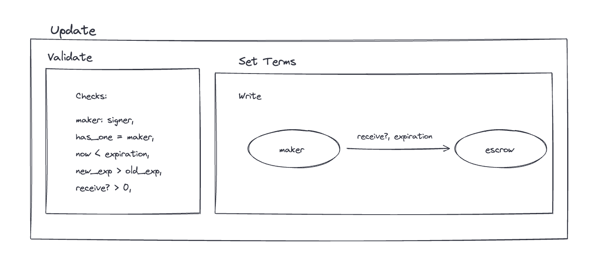
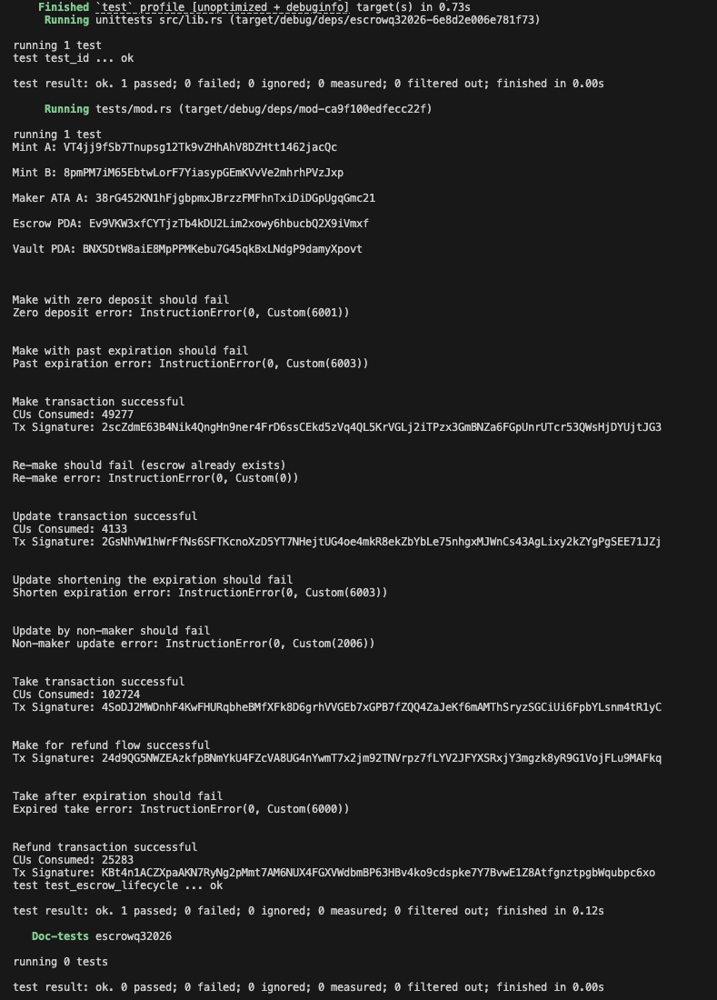

# Solana Escrow Program

A trustless, timed token-swap escrow built with [Anchor](https://www.anchor-lang.com/). A maker locks token A in a program-owned vault and names their price in token B, any taker can settle the swap atomically before the deal expires, and the maker can reclaim the deposit if nobody takes it. Neither side ever has to trust the other — or the program's deployer, since the program holds no admin keys.

Program ID (localnet): `EBXQ5AMy7zqoFV6oXzqvR9KftoTFhuDhsAX9dNQhZnrZ`

Built against the token interface, so both SPL Token and Token-2022 mints work.

## Architecture

Two accounts per escrow:

```
maker wallet
  └── escrow  PDA   seeds = ["escrow", maker, seed]   (stores the deal terms)
        └── vault  ATA   owner = escrow, mint = mint_a  (holds the deposited tokens)
```

- **`escrow`** — an `Account<Escrow>` recording the terms of the deal. The `seed` lets one maker run any number of concurrent escrows, the stored `bump` avoids re-deriving it on every instruction.
- **`vault`** — an associated token account owned by the escrow PDA. Tokens can only leave it through CPIs signed with the escrow's seeds by this program.

```rust
#[account(discriminator = 1)]
#[derive(InitSpace)]
pub struct Escrow {
    pub seed: u64,        // distinguishes multiple escrows per maker
    pub maker: Pubkey,
    pub mint_a: Pubkey,   // token deposited
    pub mint_b: Pubkey,   // token requested
    pub receive: u64,     // amount of token B the maker wants
    pub bump: u8,
    pub expiration: i64,  // unix time after which the deal is off
}
```

## Instructions

| Instruction | Discriminator | Description |
|-------------|---------------|-------------|
| `make`      | 0 | Creates the escrow and vault, then deposits `deposit` of token A. Rejects zero deposits and expirations that aren't in the future. |
| `refund`    | 2 | Maker reclaims the full vault balance, vault and escrow are closed and their rent returned to the maker. |
| `take`      | 3 | Atomic swap: taker sends `receive` of token B to the maker, the vault releases all of token A to the taker, and both escrow and vault are closed. Blocked once the escrow has expired. |
| `update`    | 4 | Maker amends a live deal: optionally sets a new `receive` price and extends the `expiration`. Blocked once expired, the expiration can only move forward. |

### Flow diagrams

| make | take | refund | update |
|------|------|--------|--------|
|  |  |  |  |

## Timed mechanism

Every deal carries an `expiration` enforced against the [clock sysvar](https://docs.solanalabs.com/runtime/sysvars#clock):

- **`make`** — requires `expiration > now`, so a deal can't be born dead.
- **`take`** — requires `now < expiration`, after that the swap window is closed and the taker gets `EscrowExpired`.
- **`update`** — only works on a live deal and only extends the window (`new expiration > current`), so a maker can't rug a pending taker by silently shortening the deal.
- **`refund`** — available to the maker at any time, letting them cancel early or clean up after expiry.

## Security model

- **Ownership by derivation** — the escrow PDA is derived from the maker's key (`seeds = ["escrow", maker, seed]`) and checked with `has_one = maker`, `has_one = mint_a`, `has_one = mint_b`. Anyone presenting mismatched accounts fails constraints before instruction logic runs.
- **PDA-signed transfers** — outbound vault transfers are CPIs signed with `["escrow", maker, seed, bump]`. only this program can produce that signature.
- **Atomic settlement** — `take` performs both legs (token B → maker, token A → taker) in one transaction. if either fails, everything rolls back.
- **No stranded rent** — both settlement paths close the vault and escrow, refunding rent (vault rent to the taker on `take`, everything else to the maker).

## Error codes

| Error | Code | Condition |
|-------|------|-----------|
| `EscrowExpired` | 6000 | `take` or `update` after the expiration |
| `InvalidDepositAmount` | 6001 | `make` with a zero deposit |
| `InvalidReceiveAmount` | 6002 | `update` setting the price to zero |
| `InvalidExpiration` | 6003 | `make` with a past expiration, or `update` shortening it |

## Build

```bash
anchor build
```

## Test

Tests run against [LiteSVM](https://github.com/LiteSVM/litesvm), an in-process SVM - no local validator needed. `anchor build` must run first so the tests can load the compiled `.so`.

```bash
anchor build
cargo test
```

### Test coverage

A single end-to-end flow test (`test_escrow_lifecycle`) exercises, in order:

- **zero-deposit make** - rejected with `InvalidDepositAmount`
- **past-expiration make** - rejected with `InvalidExpiration`
- **make** - vault funded, all escrow terms stored correctly
- **re-make** - rejected (escrow account already exists)
- **update** - expiration extended and price raised to 20 token B
- **shortening update** - rejected with `InvalidExpiration`
- **non-maker update** - attacker signing their own key fails `ConstraintSeeds`
- **take** - swap settles at the *updated* price. taker receives token A, maker receives token B, escrow and vault closed
- **expired take** - clock sysvar warped past the expiration, rejected with `EscrowExpired`
- **refund** - maker reclaims the deposit, escrow and vault closed, balances reconciled

Run with `cargo test -- --nocapture` to see per-step logs (CUs consumed, tx signatures, error codes).

# Tests cli Screenshot

All tests passing:

